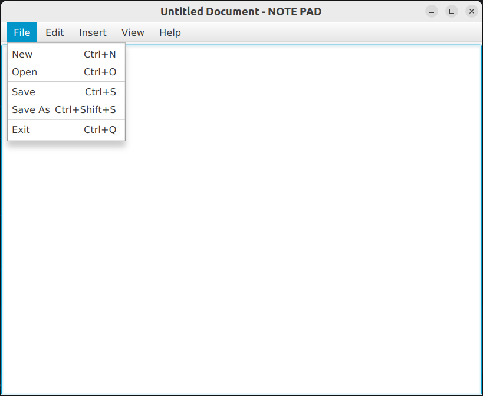

# JAVAFX NOTE PAD

### About the project

This JavaFX Notepad application provides a simple yet efficient platform for creating, editing, and managing text documents.
Built using SceneBuilder and Java, it offers essential functionalities such as creating new documents, opening existing ones,
saving files, and the option to save files with a different name. Users can also select specific portions of text or choose 
to select all content for convenient editing. The application ensures a seamless experience for users to write and manage 
their text files efficiently.

### Built with

- [Scene Builder](https://gluonhq.com/products/scene-builder/)
- [Intellij IDEA](https://www.jetbrains.com/idea/)
- [Java](https://www.oracle.com/java/)

### License
Copyright & copy ; 2024 Dep12 All Rights Reserved. 
This project is licensed under [MIT](LICENSE.txt).

### Version
0.1.0
